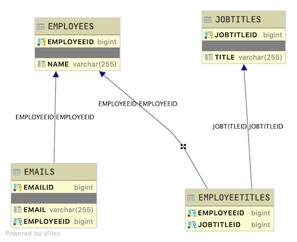

# Java Sample Employee Modeling Data

## Introduction

This project is used to introduce Java Spring REST API CRUD applications. As such it is a small application showing just the code that is needed to explain the topic.

## Database layout

The table layouts are as follows:

- Employee is the driving table
- Email has a Many-To-One relationship with Employee. Each employee has many emails. Each email has only one employee
- Jobtitles has a Many-To-Many relationship with Employee
- EmployeeTitles is the join table to represent the Many-To_Many relationship between Employee and JobTitles



Using the provided seed data, the given endpoint will produce the stated output. Expand each endpoint to see it's correct output. Due to the random nature of using Javafaker, your actual output will probably vary!!!

<details>
<summary>http://localhost:2019/employees/employees</summary>

```JSON
[
    {
        "createdBy": "SYSTEM",
        "createdDate": "2020-05-20 09:27:35",
        "lastModifiedBy": "SYSTEM",
        "lastModifiedDate": "2020-05-20 09:27:35",
        "employeeid": 3,
        "name": "CINNAMON",
        "salary": 80000.0,
        "jobnames": [
            {
                "createdBy": "SYSTEM",
                "createdDate": "2020-05-20 09:27:35",
                "lastModifiedBy": "SYSTEM",
                "lastModifiedDate": "2020-05-20 09:27:35",
                "jobname": {
                    "createdBy": "SYSTEM",
                    "createdDate": "2020-05-20 09:27:35",
                    "lastModifiedBy": "SYSTEM",
                    "lastModifiedDate": "2020-05-20 09:27:35",
                    "jobtitleid": 1,
                    "title": "Big Boss"
                },
                "manager": "MOJO"
            },
            {
                "createdBy": "SYSTEM",
                "createdDate": "2020-05-20 09:27:35",
                "lastModifiedBy": "SYSTEM",
                "lastModifiedDate": "2020-05-20 09:27:35",
                "jobname": {
                    "createdBy": "SYSTEM",
                    "createdDate": "2020-05-20 09:27:35",
                    "lastModifiedBy": "SYSTEM",
                    "lastModifiedDate": "2020-05-20 09:27:35",
                    "jobtitleid": 2,
                    "title": "Wizard"
                },
                "manager": "STUBS"
            }
        ],
        "emails": [
            {
                "createdBy": "SYSTEM",
                "createdDate": "2020-05-20 09:27:35",
                "lastModifiedBy": "SYSTEM",
                "lastModifiedDate": "2020-05-20 09:27:35",
                "emailid": 4,
                "email": "hops@local.com"
            },
            {
                "createdBy": "SYSTEM",
                "createdDate": "2020-05-20 09:27:35",
                "lastModifiedBy": "SYSTEM",
                "lastModifiedDate": "2020-05-20 09:27:35",
                "emailid": 5,
                "email": "bunny@hoppin.local"
            }
        ]
    },
    {
        "createdBy": "SYSTEM",
        "createdDate": "2020-05-20 09:27:35",
        "lastModifiedBy": "SYSTEM",
        "lastModifiedDate": "2020-05-20 09:27:35",
        "employeeid": 6,
        "name": "BARNBARN",
        "salary": 80000.0,
        "jobnames": [
            {
                "createdBy": "SYSTEM",
                "createdDate": "2020-05-20 09:27:35",
                "lastModifiedBy": "SYSTEM",
                "lastModifiedDate": "2020-05-20 09:27:35",
                "jobname": {
                    "createdBy": "SYSTEM",
                    "createdDate": "2020-05-20 09:27:35",
                    "lastModifiedBy": "SYSTEM",
                    "lastModifiedDate": "2020-05-20 09:27:35",
                    "jobtitleid": 1,
                    "title": "Big Boss"
                },
                "manager": "STUBS"
            }
        ],
        "emails": [
            {
                "createdBy": "SYSTEM",
                "createdDate": "2020-05-20 09:27:35",
                "lastModifiedBy": "SYSTEM",
                "lastModifiedDate": "2020-05-20 09:27:35",
                "emailid": 7,
                "email": "barnbarn@local.com"
            }
        ]
    },
    {
        "createdBy": "SYSTEM",
        "createdDate": "2020-05-20 09:27:35",
        "lastModifiedBy": "SYSTEM",
        "lastModifiedDate": "2020-05-20 09:27:35",
        "employeeid": 8,
        "name": "JOHN",
        "salary": 75000.0,
        "jobnames": [
            {
                "createdBy": "SYSTEM",
                "createdDate": "2020-05-20 09:27:35",
                "lastModifiedBy": "SYSTEM",
                "lastModifiedDate": "2020-05-20 09:27:35",
                "jobname": {
                    "createdBy": "SYSTEM",
                    "createdDate": "2020-05-20 09:27:35",
                    "lastModifiedBy": "SYSTEM",
                    "lastModifiedDate": "2020-05-20 09:27:35",
                    "jobtitleid": 1,
                    "title": "Big Boss"
                },
                "manager": "MOJO"
            }
        ],
        "emails": []
    },
    {
        "createdBy": "SYSTEM",
        "createdDate": "2020-05-20 09:27:36",
        "lastModifiedBy": "SYSTEM",
        "lastModifiedDate": "2020-05-20 09:27:36",
        "employeeid": 9,
        "name": "Lesley Crona",
        "salary": 75238.58321823864,
        "jobnames": [],
        "emails": []
    },
    {
        "createdBy": "SYSTEM",
        "createdDate": "2020-05-20 09:27:36",
        "lastModifiedBy": "SYSTEM",
        "lastModifiedDate": "2020-05-20 09:27:36",
        "employeeid": 10,
        "name": "Albina Satterfield",
        "salary": 75072.9150171441,
        "jobnames": [],
        "emails": []
    },
    {
        "createdBy": "SYSTEM",
        "createdDate": "2020-05-20 09:27:36",
        "lastModifiedBy": "SYSTEM",
        "lastModifiedDate": "2020-05-20 09:27:36",
        "employeeid": 11,
        "name": "Alfred Kuphal I",
        "salary": 110521.2259214581,
        "jobnames": [],
        "emails": []
    },
    {
        "createdBy": "SYSTEM",
        "createdDate": "2020-05-20 09:27:36",
        "lastModifiedBy": "SYSTEM",
        "lastModifiedDate": "2020-05-20 09:27:36",
        "employeeid": 12,
        "name": "Mr. Fay Volkman",
        "salary": 53986.74403946521,
        "jobnames": [],
        "emails": [
            {
                "createdBy": "SYSTEM",
                "createdDate": "2020-05-20 09:27:36",
                "lastModifiedBy": "SYSTEM",
                "lastModifiedDate": "2020-05-20 09:27:36",
                "emailid": 13,
                "email": "etsuko.hills@hotmail.com"
            }
        ]
    },
    {
        "createdBy": "SYSTEM",
        "createdDate": "2020-05-20 09:27:36",
        "lastModifiedBy": "SYSTEM",
        "lastModifiedDate": "2020-05-20 09:27:36",
        "employeeid": 14,
        "name": "Venice Kub",
        "salary": 81661.5423435969,
        "jobnames": [],
        "emails": [
            {
                "createdBy": "SYSTEM",
                "createdDate": "2020-05-20 09:27:36",
                "lastModifiedBy": "SYSTEM",
                "lastModifiedDate": "2020-05-20 09:27:36",
                "emailid": 15,
                "email": "angelic.kilback@yahoo.com"
            },
            {
                "createdBy": "SYSTEM",
                "createdDate": "2020-05-20 09:27:36",
                "lastModifiedBy": "SYSTEM",
                "lastModifiedDate": "2020-05-20 09:27:36",
                "emailid": 16,
                "email": "carrol.okeefe@yahoo.com"
            }
        ]
    },
    {
        "createdBy": "SYSTEM",
        "createdDate": "2020-05-20 09:27:36",
        "lastModifiedBy": "SYSTEM",
        "lastModifiedDate": "2020-05-20 09:27:36",
        "employeeid": 17,
        "name": "Douglass Shanahan",
        "salary": 72842.32064547043,
        "jobnames": [],
        "emails": []
    },
    {
        "createdBy": "SYSTEM",
        "createdDate": "2020-05-20 09:27:36",
        "lastModifiedBy": "SYSTEM",
        "lastModifiedDate": "2020-05-20 09:27:36",
        "employeeid": 18,
        "name": "Georgann Bernier III",
        "salary": 71161.57530385739,
        "jobnames": [],
        "emails": [
            {
                "createdBy": "SYSTEM",
                "createdDate": "2020-05-20 09:27:36",
                "lastModifiedBy": "SYSTEM",
                "lastModifiedDate": "2020-05-20 09:27:36",
                "emailid": 19,
                "email": "kim.yundt@hotmail.com"
            }
        ]
    },
    {
        "createdBy": "SYSTEM",
        "createdDate": "2020-05-20 09:27:36",
        "lastModifiedBy": "SYSTEM",
        "lastModifiedDate": "2020-05-20 09:27:36",
        "employeeid": 20,
        "name": "Rosamond Shanahan",
        "salary": 120184.37050907458,
        "jobnames": [],
        "emails": [
            {
                "createdBy": "SYSTEM",
                "createdDate": "2020-05-20 09:27:36",
                "lastModifiedBy": "SYSTEM",
                "lastModifiedDate": "2020-05-20 09:27:36",
                "emailid": 21,
                "email": "sheldon.denesik@gmail.com"
            },
            {
                "createdBy": "SYSTEM",
                "createdDate": "2020-05-20 09:27:36",
                "lastModifiedBy": "SYSTEM",
                "lastModifiedDate": "2020-05-20 09:27:36",
                "emailid": 22,
                "email": "kyle.oconner@hotmail.com"
            }
        ]
    },
    {
        "createdBy": "SYSTEM",
        "createdDate": "2020-05-20 09:27:36",
        "lastModifiedBy": "SYSTEM",
        "lastModifiedDate": "2020-05-20 09:27:36",
        "employeeid": 23,
        "name": "Greg Carter IV",
        "salary": 72315.93297384189,
        "jobnames": [],
        "emails": [
            {
                "createdBy": "SYSTEM",
                "createdDate": "2020-05-20 09:27:36",
                "lastModifiedBy": "SYSTEM",
                "lastModifiedDate": "2020-05-20 09:27:36",
                "emailid": 24,
                "email": "shonta.legros@gmail.com"
            }
        ]
    },
    {
        "createdBy": "SYSTEM",
        "createdDate": "2020-05-20 09:27:36",
        "lastModifiedBy": "SYSTEM",
        "lastModifiedDate": "2020-05-20 09:27:36",
        "employeeid": 25,
        "name": "Theresa Legros",
        "salary": 61855.506276924076,
        "jobnames": [],
        "emails": [
            {
                "createdBy": "SYSTEM",
                "createdDate": "2020-05-20 09:27:36",
                "lastModifiedBy": "SYSTEM",
                "lastModifiedDate": "2020-05-20 09:27:36",
                "emailid": 26,
                "email": "tory.monahan@gmail.com"
            }
        ]
    },
    {
        "createdBy": "SYSTEM",
        "createdDate": "2020-05-20 09:27:36",
        "lastModifiedBy": "SYSTEM",
        "lastModifiedDate": "2020-05-20 09:27:36",
        "employeeid": 27,
        "name": "Hyon Kozey",
        "salary": 146343.23459214822,
        "jobnames": [],
        "emails": [
            {
                "createdBy": "SYSTEM",
                "createdDate": "2020-05-20 09:27:36",
                "lastModifiedBy": "SYSTEM",
                "lastModifiedDate": "2020-05-20 09:27:36",
                "emailid": 28,
                "email": "columbus.lakin@hotmail.com"
            },
            {
                "createdBy": "SYSTEM",
                "createdDate": "2020-05-20 09:27:36",
                "lastModifiedBy": "SYSTEM",
                "lastModifiedDate": "2020-05-20 09:27:36",
                "emailid": 29,
                "email": "ute.howe@gmail.com"
            }
        ]
    },
    {
        "createdBy": "SYSTEM",
        "createdDate": "2020-05-20 09:27:36",
        "lastModifiedBy": "SYSTEM",
        "lastModifiedDate": "2020-05-20 09:27:36",
        "employeeid": 30,
        "name": "Deidre Wehner",
        "salary": 122047.57997149513,
        "jobnames": [],
        "emails": [
            {
                "createdBy": "SYSTEM",
                "createdDate": "2020-05-20 09:27:36",
                "lastModifiedBy": "SYSTEM",
                "lastModifiedDate": "2020-05-20 09:27:36",
                "emailid": 31,
                "email": "corrina.johnston@yahoo.com"
            },
            {
                "createdBy": "SYSTEM",
                "createdDate": "2020-05-20 09:27:36",
                "lastModifiedBy": "SYSTEM",
                "lastModifiedDate": "2020-05-20 09:27:36",
                "emailid": 32,
                "email": "cyndi.balistreri@hotmail.com"
            }
        ]
    },
    {
        "createdBy": "SYSTEM",
        "createdDate": "2020-05-20 09:27:36",
        "lastModifiedBy": "SYSTEM",
        "lastModifiedDate": "2020-05-20 09:27:36",
        "employeeid": 33,
        "name": "Karie Senger",
        "salary": 69753.78726125232,
        "jobnames": [],
        "emails": [
            {
                "createdBy": "SYSTEM",
                "createdDate": "2020-05-20 09:27:36",
                "lastModifiedBy": "SYSTEM",
                "lastModifiedDate": "2020-05-20 09:27:36",
                "emailid": 34,
                "email": "bobette.borer@yahoo.com"
            }
        ]
    },
    {
        "createdBy": "SYSTEM",
        "createdDate": "2020-05-20 09:27:36",
        "lastModifiedBy": "SYSTEM",
        "lastModifiedDate": "2020-05-20 09:27:36",
        "employeeid": 35,
        "name": "Chad Lueilwitz",
        "salary": 147323.64420229153,
        "jobnames": [],
        "emails": [
            {
                "createdBy": "SYSTEM",
                "createdDate": "2020-05-20 09:27:36",
                "lastModifiedBy": "SYSTEM",
                "lastModifiedDate": "2020-05-20 09:27:36",
                "emailid": 36,
                "email": "vikki.nader@yahoo.com"
            }
        ]
    },
    {
        "createdBy": "SYSTEM",
        "createdDate": "2020-05-20 09:27:36",
        "lastModifiedBy": "SYSTEM",
        "lastModifiedDate": "2020-05-20 09:27:36",
        "employeeid": 37,
        "name": "Daron Reilly",
        "salary": 114376.62783605908,
        "jobnames": [],
        "emails": [
            {
                "createdBy": "SYSTEM",
                "createdDate": "2020-05-20 09:27:36",
                "lastModifiedBy": "SYSTEM",
                "lastModifiedDate": "2020-05-20 09:27:36",
                "emailid": 38,
                "email": "huey.bahringer@gmail.com"
            },
            {
                "createdBy": "SYSTEM",
                "createdDate": "2020-05-20 09:27:36",
                "lastModifiedBy": "SYSTEM",
                "lastModifiedDate": "2020-05-20 09:27:36",
                "emailid": 39,
                "email": "jerold.effertz@yahoo.com"
            }
        ]
    },
    {
        "createdBy": "SYSTEM",
        "createdDate": "2020-05-20 09:27:36",
        "lastModifiedBy": "SYSTEM",
        "lastModifiedDate": "2020-05-20 09:27:36",
        "employeeid": 40,
        "name": "Darcey Hodkiewicz",
        "salary": 89563.2304175265,
        "jobnames": [],
        "emails": [
            {
                "createdBy": "SYSTEM",
                "createdDate": "2020-05-20 09:27:36",
                "lastModifiedBy": "SYSTEM",
                "lastModifiedDate": "2020-05-20 09:27:36",
                "emailid": 41,
                "email": "aurelia.littel@gmail.com"
            },
            {
                "createdBy": "SYSTEM",
                "createdDate": "2020-05-20 09:27:36",
                "lastModifiedBy": "SYSTEM",
                "lastModifiedDate": "2020-05-20 09:27:36",
                "emailid": 42,
                "email": "jeanine.bode@yahoo.com"
            }
        ]
    },
    {
        "createdBy": "SYSTEM",
        "createdDate": "2020-05-20 09:27:36",
        "lastModifiedBy": "SYSTEM",
        "lastModifiedDate": "2020-05-20 09:27:36",
        "employeeid": 43,
        "name": "Kamala Rau",
        "salary": 82660.96913173198,
        "jobnames": [],
        "emails": []
    },
    {
        "createdBy": "SYSTEM",
        "createdDate": "2020-05-20 09:27:36",
        "lastModifiedBy": "SYSTEM",
        "lastModifiedDate": "2020-05-20 09:27:36",
        "employeeid": 44,
        "name": "Andra Hammes",
        "salary": 127269.07812767939,
        "jobnames": [],
        "emails": [
            {
                "createdBy": "SYSTEM",
                "createdDate": "2020-05-20 09:27:36",
                "lastModifiedBy": "SYSTEM",
                "lastModifiedDate": "2020-05-20 09:27:36",
                "emailid": 45,
                "email": "leonel.conroy@hotmail.com"
            }
        ]
    },
    {
        "createdBy": "SYSTEM",
        "createdDate": "2020-05-20 09:27:36",
        "lastModifiedBy": "SYSTEM",
        "lastModifiedDate": "2020-05-20 09:27:36",
        "employeeid": 46,
        "name": "Margo Hoppe",
        "salary": 130253.76173539522,
        "jobnames": [],
        "emails": [
            {
                "createdBy": "SYSTEM",
                "createdDate": "2020-05-20 09:27:36",
                "lastModifiedBy": "SYSTEM",
                "lastModifiedDate": "2020-05-20 09:27:36",
                "emailid": 47,
                "email": "quyen.parisian@hotmail.com"
            }
        ]
    },
    {
        "createdBy": "SYSTEM",
        "createdDate": "2020-05-20 09:27:36",
        "lastModifiedBy": "SYSTEM",
        "lastModifiedDate": "2020-05-20 09:27:36",
        "employeeid": 48,
        "name": "Claude Goodwin",
        "salary": 140637.4086647122,
        "jobnames": [],
        "emails": [
            {
                "createdBy": "SYSTEM",
                "createdDate": "2020-05-20 09:27:36",
                "lastModifiedBy": "SYSTEM",
                "lastModifiedDate": "2020-05-20 09:27:36",
                "emailid": 49,
                "email": "lavina.mann@hotmail.com"
            },
            {
                "createdBy": "SYSTEM",
                "createdDate": "2020-05-20 09:27:36",
                "lastModifiedBy": "SYSTEM",
                "lastModifiedDate": "2020-05-20 09:27:36",
                "emailid": 50,
                "email": "brant.haag@gmail.com"
            }
        ]
    },
    {
        "createdBy": "SYSTEM",
        "createdDate": "2020-05-20 09:27:36",
        "lastModifiedBy": "SYSTEM",
        "lastModifiedDate": "2020-05-20 09:27:36",
        "employeeid": 51,
        "name": "Mickey Dare I",
        "salary": 128284.75469574441,
        "jobnames": [],
        "emails": [
            {
                "createdBy": "SYSTEM",
                "createdDate": "2020-05-20 09:27:36",
                "lastModifiedBy": "SYSTEM",
                "lastModifiedDate": "2020-05-20 09:27:36",
                "emailid": 52,
                "email": "caitlyn.fadel@hotmail.com"
            }
        ]
    },
    {
        "createdBy": "SYSTEM",
        "createdDate": "2020-05-20 09:27:36",
        "lastModifiedBy": "SYSTEM",
        "lastModifiedDate": "2020-05-20 09:27:36",
        "employeeid": 53,
        "name": "Demetrius Effertz",
        "salary": 127762.5739489486,
        "jobnames": [],
        "emails": []
    },
    {
        "createdBy": "SYSTEM",
        "createdDate": "2020-05-20 09:27:36",
        "lastModifiedBy": "SYSTEM",
        "lastModifiedDate": "2020-05-20 09:27:36",
        "employeeid": 54,
        "name": "Randal Borer V",
        "salary": 103081.0398124823,
        "jobnames": [],
        "emails": [
            {
                "createdBy": "SYSTEM",
                "createdDate": "2020-05-20 09:27:36",
                "lastModifiedBy": "SYSTEM",
                "lastModifiedDate": "2020-05-20 09:27:36",
                "emailid": 55,
                "email": "benedict.gibson@yahoo.com"
            },
            {
                "createdBy": "SYSTEM",
                "createdDate": "2020-05-20 09:27:36",
                "lastModifiedBy": "SYSTEM",
                "lastModifiedDate": "2020-05-20 09:27:36",
                "emailid": 56,
                "email": "shannon.weimann@hotmail.com"
            }
        ]
    },
    {
        "createdBy": "SYSTEM",
        "createdDate": "2020-05-20 09:27:36",
        "lastModifiedBy": "SYSTEM",
        "lastModifiedDate": "2020-05-20 09:27:36",
        "employeeid": 57,
        "name": "Rosalee Christiansen DVM",
        "salary": 95800.73492155221,
        "jobnames": [],
        "emails": [
            {
                "createdBy": "SYSTEM",
                "createdDate": "2020-05-20 09:27:36",
                "lastModifiedBy": "SYSTEM",
                "lastModifiedDate": "2020-05-20 09:27:36",
                "emailid": 58,
                "email": "marisela.wisozk@gmail.com"
            }
        ]
    },
    {
        "createdBy": "SYSTEM",
        "createdDate": "2020-05-20 09:27:36",
        "lastModifiedBy": "SYSTEM",
        "lastModifiedDate": "2020-05-20 09:27:36",
        "employeeid": 59,
        "name": "Delores Kautzer Jr.",
        "salary": 77157.08442955291,
        "jobnames": [],
        "emails": [
            {
                "createdBy": "SYSTEM",
                "createdDate": "2020-05-20 09:27:36",
                "lastModifiedBy": "SYSTEM",
                "lastModifiedDate": "2020-05-20 09:27:36",
                "emailid": 60,
                "email": "leland.kohler@gmail.com"
            },
            {
                "createdBy": "SYSTEM",
                "createdDate": "2020-05-20 09:27:36",
                "lastModifiedBy": "SYSTEM",
                "lastModifiedDate": "2020-05-20 09:27:36",
                "emailid": 61,
                "email": "chrissy.monahan@yahoo.com"
            }
        ]
    }
]
```

</details>

<details>
<summary>http://localhost:2019/employees/employeeemail/com</summary>

```JSON
[
    {
        "createdBy": "SYSTEM",
        "createdDate": "2020-05-20 09:27:35",
        "lastModifiedBy": "SYSTEM",
        "lastModifiedDate": "2020-05-20 09:27:35",
        "employeeid": 3,
        "name": "CINNAMON",
        "salary": 80000.0,
        "jobnames": [
            {
                "createdBy": "SYSTEM",
                "createdDate": "2020-05-20 09:27:35",
                "lastModifiedBy": "SYSTEM",
                "lastModifiedDate": "2020-05-20 09:27:35",
                "jobname": {
                    "createdBy": "SYSTEM",
                    "createdDate": "2020-05-20 09:27:35",
                    "lastModifiedBy": "SYSTEM",
                    "lastModifiedDate": "2020-05-20 09:27:35",
                    "jobtitleid": 1,
                    "title": "Big Boss"
                },
                "manager": "MOJO"
            },
            {
                "createdBy": "SYSTEM",
                "createdDate": "2020-05-20 09:27:35",
                "lastModifiedBy": "SYSTEM",
                "lastModifiedDate": "2020-05-20 09:27:35",
                "jobname": {
                    "createdBy": "SYSTEM",
                    "createdDate": "2020-05-20 09:27:35",
                    "lastModifiedBy": "SYSTEM",
                    "lastModifiedDate": "2020-05-20 09:27:35",
                    "jobtitleid": 2,
                    "title": "Wizard"
                },
                "manager": "STUBS"
            }
        ],
        "emails": [
            {
                "createdBy": "SYSTEM",
                "createdDate": "2020-05-20 09:27:35",
                "lastModifiedBy": "SYSTEM",
                "lastModifiedDate": "2020-05-20 09:27:35",
                "emailid": 4,
                "email": "hops@local.com"
            },
            {
                "createdBy": "SYSTEM",
                "createdDate": "2020-05-20 09:27:35",
                "lastModifiedBy": "SYSTEM",
                "lastModifiedDate": "2020-05-20 09:27:35",
                "emailid": 5,
                "email": "bunny@hoppin.local"
            }
        ]
    },
    {
        "createdBy": "SYSTEM",
        "createdDate": "2020-05-20 09:27:35",
        "lastModifiedBy": "SYSTEM",
        "lastModifiedDate": "2020-05-20 09:27:35",
        "employeeid": 6,
        "name": "BARNBARN",
        "salary": 80000.0,
        "jobnames": [
            {
                "createdBy": "SYSTEM",
                "createdDate": "2020-05-20 09:27:35",
                "lastModifiedBy": "SYSTEM",
                "lastModifiedDate": "2020-05-20 09:27:35",
                "jobname": {
                    "createdBy": "SYSTEM",
                    "createdDate": "2020-05-20 09:27:35",
                    "lastModifiedBy": "SYSTEM",
                    "lastModifiedDate": "2020-05-20 09:27:35",
                    "jobtitleid": 1,
                    "title": "Big Boss"
                },
                "manager": "STUBS"
            }
        ],
        "emails": [
            {
                "createdBy": "SYSTEM",
                "createdDate": "2020-05-20 09:27:35",
                "lastModifiedBy": "SYSTEM",
                "lastModifiedDate": "2020-05-20 09:27:35",
                "emailid": 7,
                "email": "barnbarn@local.com"
            }
        ]
    },
    {
        "createdBy": "SYSTEM",
        "createdDate": "2020-05-20 09:27:36",
        "lastModifiedBy": "SYSTEM",
        "lastModifiedDate": "2020-05-20 09:27:36",
        "employeeid": 12,
        "name": "Mr. Fay Volkman",
        "salary": 53986.74403946521,
        "jobnames": [],
        "emails": [
            {
                "createdBy": "SYSTEM",
                "createdDate": "2020-05-20 09:27:36",
                "lastModifiedBy": "SYSTEM",
                "lastModifiedDate": "2020-05-20 09:27:36",
                "emailid": 13,
                "email": "etsuko.hills@hotmail.com"
            }
        ]
    },
    {
        "createdBy": "SYSTEM",
        "createdDate": "2020-05-20 09:27:36",
        "lastModifiedBy": "SYSTEM",
        "lastModifiedDate": "2020-05-20 09:27:36",
        "employeeid": 14,
        "name": "Venice Kub",
        "salary": 81661.5423435969,
        "jobnames": [],
        "emails": [
            {
                "createdBy": "SYSTEM",
                "createdDate": "2020-05-20 09:27:36",
                "lastModifiedBy": "SYSTEM",
                "lastModifiedDate": "2020-05-20 09:27:36",
                "emailid": 15,
                "email": "angelic.kilback@yahoo.com"
            },
            {
                "createdBy": "SYSTEM",
                "createdDate": "2020-05-20 09:27:36",
                "lastModifiedBy": "SYSTEM",
                "lastModifiedDate": "2020-05-20 09:27:36",
                "emailid": 16,
                "email": "carrol.okeefe@yahoo.com"
            }
        ]
    },
    {
        "createdBy": "SYSTEM",
        "createdDate": "2020-05-20 09:27:36",
        "lastModifiedBy": "SYSTEM",
        "lastModifiedDate": "2020-05-20 09:27:36",
        "employeeid": 14,
        "name": "Venice Kub",
        "salary": 81661.5423435969,
        "jobnames": [],
        "emails": [
            {
                "createdBy": "SYSTEM",
                "createdDate": "2020-05-20 09:27:36",
                "lastModifiedBy": "SYSTEM",
                "lastModifiedDate": "2020-05-20 09:27:36",
                "emailid": 15,
                "email": "angelic.kilback@yahoo.com"
            },
            {
                "createdBy": "SYSTEM",
                "createdDate": "2020-05-20 09:27:36",
                "lastModifiedBy": "SYSTEM",
                "lastModifiedDate": "2020-05-20 09:27:36",
                "emailid": 16,
                "email": "carrol.okeefe@yahoo.com"
            }
        ]
    },
    {
        "createdBy": "SYSTEM",
        "createdDate": "2020-05-20 09:27:36",
        "lastModifiedBy": "SYSTEM",
        "lastModifiedDate": "2020-05-20 09:27:36",
        "employeeid": 18,
        "name": "Georgann Bernier III",
        "salary": 71161.57530385739,
        "jobnames": [],
        "emails": [
            {
                "createdBy": "SYSTEM",
                "createdDate": "2020-05-20 09:27:36",
                "lastModifiedBy": "SYSTEM",
                "lastModifiedDate": "2020-05-20 09:27:36",
                "emailid": 19,
                "email": "kim.yundt@hotmail.com"
            }
        ]
    },
    {
        "createdBy": "SYSTEM",
        "createdDate": "2020-05-20 09:27:36",
        "lastModifiedBy": "SYSTEM",
        "lastModifiedDate": "2020-05-20 09:27:36",
        "employeeid": 20,
        "name": "Rosamond Shanahan",
        "salary": 120184.37050907458,
        "jobnames": [],
        "emails": [
            {
                "createdBy": "SYSTEM",
                "createdDate": "2020-05-20 09:27:36",
                "lastModifiedBy": "SYSTEM",
                "lastModifiedDate": "2020-05-20 09:27:36",
                "emailid": 21,
                "email": "sheldon.denesik@gmail.com"
            },
            {
                "createdBy": "SYSTEM",
                "createdDate": "2020-05-20 09:27:36",
                "lastModifiedBy": "SYSTEM",
                "lastModifiedDate": "2020-05-20 09:27:36",
                "emailid": 22,
                "email": "kyle.oconner@hotmail.com"
            }
        ]
    },
    {
        "createdBy": "SYSTEM",
        "createdDate": "2020-05-20 09:27:36",
        "lastModifiedBy": "SYSTEM",
        "lastModifiedDate": "2020-05-20 09:27:36",
        "employeeid": 20,
        "name": "Rosamond Shanahan",
        "salary": 120184.37050907458,
        "jobnames": [],
        "emails": [
            {
                "createdBy": "SYSTEM",
                "createdDate": "2020-05-20 09:27:36",
                "lastModifiedBy": "SYSTEM",
                "lastModifiedDate": "2020-05-20 09:27:36",
                "emailid": 21,
                "email": "sheldon.denesik@gmail.com"
            },
            {
                "createdBy": "SYSTEM",
                "createdDate": "2020-05-20 09:27:36",
                "lastModifiedBy": "SYSTEM",
                "lastModifiedDate": "2020-05-20 09:27:36",
                "emailid": 22,
                "email": "kyle.oconner@hotmail.com"
            }
        ]
    },
    {
        "createdBy": "SYSTEM",
        "createdDate": "2020-05-20 09:27:36",
        "lastModifiedBy": "SYSTEM",
        "lastModifiedDate": "2020-05-20 09:27:36",
        "employeeid": 23,
        "name": "Greg Carter IV",
        "salary": 72315.93297384189,
        "jobnames": [],
        "emails": [
            {
                "createdBy": "SYSTEM",
                "createdDate": "2020-05-20 09:27:36",
                "lastModifiedBy": "SYSTEM",
                "lastModifiedDate": "2020-05-20 09:27:36",
                "emailid": 24,
                "email": "shonta.legros@gmail.com"
            }
        ]
    },
    {
        "createdBy": "SYSTEM",
        "createdDate": "2020-05-20 09:27:36",
        "lastModifiedBy": "SYSTEM",
        "lastModifiedDate": "2020-05-20 09:27:36",
        "employeeid": 25,
        "name": "Theresa Legros",
        "salary": 61855.506276924076,
        "jobnames": [],
        "emails": [
            {
                "createdBy": "SYSTEM",
                "createdDate": "2020-05-20 09:27:36",
                "lastModifiedBy": "SYSTEM",
                "lastModifiedDate": "2020-05-20 09:27:36",
                "emailid": 26,
                "email": "tory.monahan@gmail.com"
            }
        ]
    },
    {
        "createdBy": "SYSTEM",
        "createdDate": "2020-05-20 09:27:36",
        "lastModifiedBy": "SYSTEM",
        "lastModifiedDate": "2020-05-20 09:27:36",
        "employeeid": 27,
        "name": "Hyon Kozey",
        "salary": 146343.23459214822,
        "jobnames": [],
        "emails": [
            {
                "createdBy": "SYSTEM",
                "createdDate": "2020-05-20 09:27:36",
                "lastModifiedBy": "SYSTEM",
                "lastModifiedDate": "2020-05-20 09:27:36",
                "emailid": 28,
                "email": "columbus.lakin@hotmail.com"
            },
            {
                "createdBy": "SYSTEM",
                "createdDate": "2020-05-20 09:27:36",
                "lastModifiedBy": "SYSTEM",
                "lastModifiedDate": "2020-05-20 09:27:36",
                "emailid": 29,
                "email": "ute.howe@gmail.com"
            }
        ]
    },
    {
        "createdBy": "SYSTEM",
        "createdDate": "2020-05-20 09:27:36",
        "lastModifiedBy": "SYSTEM",
        "lastModifiedDate": "2020-05-20 09:27:36",
        "employeeid": 27,
        "name": "Hyon Kozey",
        "salary": 146343.23459214822,
        "jobnames": [],
        "emails": [
            {
                "createdBy": "SYSTEM",
                "createdDate": "2020-05-20 09:27:36",
                "lastModifiedBy": "SYSTEM",
                "lastModifiedDate": "2020-05-20 09:27:36",
                "emailid": 28,
                "email": "columbus.lakin@hotmail.com"
            },
            {
                "createdBy": "SYSTEM",
                "createdDate": "2020-05-20 09:27:36",
                "lastModifiedBy": "SYSTEM",
                "lastModifiedDate": "2020-05-20 09:27:36",
                "emailid": 29,
                "email": "ute.howe@gmail.com"
            }
        ]
    },
    {
        "createdBy": "SYSTEM",
        "createdDate": "2020-05-20 09:27:36",
        "lastModifiedBy": "SYSTEM",
        "lastModifiedDate": "2020-05-20 09:27:36",
        "employeeid": 30,
        "name": "Deidre Wehner",
        "salary": 122047.57997149513,
        "jobnames": [],
        "emails": [
            {
                "createdBy": "SYSTEM",
                "createdDate": "2020-05-20 09:27:36",
                "lastModifiedBy": "SYSTEM",
                "lastModifiedDate": "2020-05-20 09:27:36",
                "emailid": 31,
                "email": "corrina.johnston@yahoo.com"
            },
            {
                "createdBy": "SYSTEM",
                "createdDate": "2020-05-20 09:27:36",
                "lastModifiedBy": "SYSTEM",
                "lastModifiedDate": "2020-05-20 09:27:36",
                "emailid": 32,
                "email": "cyndi.balistreri@hotmail.com"
            }
        ]
    },
    {
        "createdBy": "SYSTEM",
        "createdDate": "2020-05-20 09:27:36",
        "lastModifiedBy": "SYSTEM",
        "lastModifiedDate": "2020-05-20 09:27:36",
        "employeeid": 30,
        "name": "Deidre Wehner",
        "salary": 122047.57997149513,
        "jobnames": [],
        "emails": [
            {
                "createdBy": "SYSTEM",
                "createdDate": "2020-05-20 09:27:36",
                "lastModifiedBy": "SYSTEM",
                "lastModifiedDate": "2020-05-20 09:27:36",
                "emailid": 31,
                "email": "corrina.johnston@yahoo.com"
            },
            {
                "createdBy": "SYSTEM",
                "createdDate": "2020-05-20 09:27:36",
                "lastModifiedBy": "SYSTEM",
                "lastModifiedDate": "2020-05-20 09:27:36",
                "emailid": 32,
                "email": "cyndi.balistreri@hotmail.com"
            }
        ]
    },
    {
        "createdBy": "SYSTEM",
        "createdDate": "2020-05-20 09:27:36",
        "lastModifiedBy": "SYSTEM",
        "lastModifiedDate": "2020-05-20 09:27:36",
        "employeeid": 33,
        "name": "Karie Senger",
        "salary": 69753.78726125232,
        "jobnames": [],
        "emails": [
            {
                "createdBy": "SYSTEM",
                "createdDate": "2020-05-20 09:27:36",
                "lastModifiedBy": "SYSTEM",
                "lastModifiedDate": "2020-05-20 09:27:36",
                "emailid": 34,
                "email": "bobette.borer@yahoo.com"
            }
        ]
    },
    {
        "createdBy": "SYSTEM",
        "createdDate": "2020-05-20 09:27:36",
        "lastModifiedBy": "SYSTEM",
        "lastModifiedDate": "2020-05-20 09:27:36",
        "employeeid": 35,
        "name": "Chad Lueilwitz",
        "salary": 147323.64420229153,
        "jobnames": [],
        "emails": [
            {
                "createdBy": "SYSTEM",
                "createdDate": "2020-05-20 09:27:36",
                "lastModifiedBy": "SYSTEM",
                "lastModifiedDate": "2020-05-20 09:27:36",
                "emailid": 36,
                "email": "vikki.nader@yahoo.com"
            }
        ]
    },
    {
        "createdBy": "SYSTEM",
        "createdDate": "2020-05-20 09:27:36",
        "lastModifiedBy": "SYSTEM",
        "lastModifiedDate": "2020-05-20 09:27:36",
        "employeeid": 37,
        "name": "Daron Reilly",
        "salary": 114376.62783605908,
        "jobnames": [],
        "emails": [
            {
                "createdBy": "SYSTEM",
                "createdDate": "2020-05-20 09:27:36",
                "lastModifiedBy": "SYSTEM",
                "lastModifiedDate": "2020-05-20 09:27:36",
                "emailid": 38,
                "email": "huey.bahringer@gmail.com"
            },
            {
                "createdBy": "SYSTEM",
                "createdDate": "2020-05-20 09:27:36",
                "lastModifiedBy": "SYSTEM",
                "lastModifiedDate": "2020-05-20 09:27:36",
                "emailid": 39,
                "email": "jerold.effertz@yahoo.com"
            }
        ]
    },
    {
        "createdBy": "SYSTEM",
        "createdDate": "2020-05-20 09:27:36",
        "lastModifiedBy": "SYSTEM",
        "lastModifiedDate": "2020-05-20 09:27:36",
        "employeeid": 37,
        "name": "Daron Reilly",
        "salary": 114376.62783605908,
        "jobnames": [],
        "emails": [
            {
                "createdBy": "SYSTEM",
                "createdDate": "2020-05-20 09:27:36",
                "lastModifiedBy": "SYSTEM",
                "lastModifiedDate": "2020-05-20 09:27:36",
                "emailid": 38,
                "email": "huey.bahringer@gmail.com"
            },
            {
                "createdBy": "SYSTEM",
                "createdDate": "2020-05-20 09:27:36",
                "lastModifiedBy": "SYSTEM",
                "lastModifiedDate": "2020-05-20 09:27:36",
                "emailid": 39,
                "email": "jerold.effertz@yahoo.com"
            }
        ]
    },
    {
        "createdBy": "SYSTEM",
        "createdDate": "2020-05-20 09:27:36",
        "lastModifiedBy": "SYSTEM",
        "lastModifiedDate": "2020-05-20 09:27:36",
        "employeeid": 40,
        "name": "Darcey Hodkiewicz",
        "salary": 89563.2304175265,
        "jobnames": [],
        "emails": [
            {
                "createdBy": "SYSTEM",
                "createdDate": "2020-05-20 09:27:36",
                "lastModifiedBy": "SYSTEM",
                "lastModifiedDate": "2020-05-20 09:27:36",
                "emailid": 41,
                "email": "aurelia.littel@gmail.com"
            },
            {
                "createdBy": "SYSTEM",
                "createdDate": "2020-05-20 09:27:36",
                "lastModifiedBy": "SYSTEM",
                "lastModifiedDate": "2020-05-20 09:27:36",
                "emailid": 42,
                "email": "jeanine.bode@yahoo.com"
            }
        ]
    },
    {
        "createdBy": "SYSTEM",
        "createdDate": "2020-05-20 09:27:36",
        "lastModifiedBy": "SYSTEM",
        "lastModifiedDate": "2020-05-20 09:27:36",
        "employeeid": 40,
        "name": "Darcey Hodkiewicz",
        "salary": 89563.2304175265,
        "jobnames": [],
        "emails": [
            {
                "createdBy": "SYSTEM",
                "createdDate": "2020-05-20 09:27:36",
                "lastModifiedBy": "SYSTEM",
                "lastModifiedDate": "2020-05-20 09:27:36",
                "emailid": 41,
                "email": "aurelia.littel@gmail.com"
            },
            {
                "createdBy": "SYSTEM",
                "createdDate": "2020-05-20 09:27:36",
                "lastModifiedBy": "SYSTEM",
                "lastModifiedDate": "2020-05-20 09:27:36",
                "emailid": 42,
                "email": "jeanine.bode@yahoo.com"
            }
        ]
    },
    {
        "createdBy": "SYSTEM",
        "createdDate": "2020-05-20 09:27:36",
        "lastModifiedBy": "SYSTEM",
        "lastModifiedDate": "2020-05-20 09:27:36",
        "employeeid": 44,
        "name": "Andra Hammes",
        "salary": 127269.07812767939,
        "jobnames": [],
        "emails": [
            {
                "createdBy": "SYSTEM",
                "createdDate": "2020-05-20 09:27:36",
                "lastModifiedBy": "SYSTEM",
                "lastModifiedDate": "2020-05-20 09:27:36",
                "emailid": 45,
                "email": "leonel.conroy@hotmail.com"
            }
        ]
    },
    {
        "createdBy": "SYSTEM",
        "createdDate": "2020-05-20 09:27:36",
        "lastModifiedBy": "SYSTEM",
        "lastModifiedDate": "2020-05-20 09:27:36",
        "employeeid": 46,
        "name": "Margo Hoppe",
        "salary": 130253.76173539522,
        "jobnames": [],
        "emails": [
            {
                "createdBy": "SYSTEM",
                "createdDate": "2020-05-20 09:27:36",
                "lastModifiedBy": "SYSTEM",
                "lastModifiedDate": "2020-05-20 09:27:36",
                "emailid": 47,
                "email": "quyen.parisian@hotmail.com"
            }
        ]
    },
    {
        "createdBy": "SYSTEM",
        "createdDate": "2020-05-20 09:27:36",
        "lastModifiedBy": "SYSTEM",
        "lastModifiedDate": "2020-05-20 09:27:36",
        "employeeid": 48,
        "name": "Claude Goodwin",
        "salary": 140637.4086647122,
        "jobnames": [],
        "emails": [
            {
                "createdBy": "SYSTEM",
                "createdDate": "2020-05-20 09:27:36",
                "lastModifiedBy": "SYSTEM",
                "lastModifiedDate": "2020-05-20 09:27:36",
                "emailid": 49,
                "email": "lavina.mann@hotmail.com"
            },
            {
                "createdBy": "SYSTEM",
                "createdDate": "2020-05-20 09:27:36",
                "lastModifiedBy": "SYSTEM",
                "lastModifiedDate": "2020-05-20 09:27:36",
                "emailid": 50,
                "email": "brant.haag@gmail.com"
            }
        ]
    },
    {
        "createdBy": "SYSTEM",
        "createdDate": "2020-05-20 09:27:36",
        "lastModifiedBy": "SYSTEM",
        "lastModifiedDate": "2020-05-20 09:27:36",
        "employeeid": 48,
        "name": "Claude Goodwin",
        "salary": 140637.4086647122,
        "jobnames": [],
        "emails": [
            {
                "createdBy": "SYSTEM",
                "createdDate": "2020-05-20 09:27:36",
                "lastModifiedBy": "SYSTEM",
                "lastModifiedDate": "2020-05-20 09:27:36",
                "emailid": 49,
                "email": "lavina.mann@hotmail.com"
            },
            {
                "createdBy": "SYSTEM",
                "createdDate": "2020-05-20 09:27:36",
                "lastModifiedBy": "SYSTEM",
                "lastModifiedDate": "2020-05-20 09:27:36",
                "emailid": 50,
                "email": "brant.haag@gmail.com"
            }
        ]
    },
    {
        "createdBy": "SYSTEM",
        "createdDate": "2020-05-20 09:27:36",
        "lastModifiedBy": "SYSTEM",
        "lastModifiedDate": "2020-05-20 09:27:36",
        "employeeid": 51,
        "name": "Mickey Dare I",
        "salary": 128284.75469574441,
        "jobnames": [],
        "emails": [
            {
                "createdBy": "SYSTEM",
                "createdDate": "2020-05-20 09:27:36",
                "lastModifiedBy": "SYSTEM",
                "lastModifiedDate": "2020-05-20 09:27:36",
                "emailid": 52,
                "email": "caitlyn.fadel@hotmail.com"
            }
        ]
    },
    {
        "createdBy": "SYSTEM",
        "createdDate": "2020-05-20 09:27:36",
        "lastModifiedBy": "SYSTEM",
        "lastModifiedDate": "2020-05-20 09:27:36",
        "employeeid": 54,
        "name": "Randal Borer V",
        "salary": 103081.0398124823,
        "jobnames": [],
        "emails": [
            {
                "createdBy": "SYSTEM",
                "createdDate": "2020-05-20 09:27:36",
                "lastModifiedBy": "SYSTEM",
                "lastModifiedDate": "2020-05-20 09:27:36",
                "emailid": 55,
                "email": "benedict.gibson@yahoo.com"
            },
            {
                "createdBy": "SYSTEM",
                "createdDate": "2020-05-20 09:27:36",
                "lastModifiedBy": "SYSTEM",
                "lastModifiedDate": "2020-05-20 09:27:36",
                "emailid": 56,
                "email": "shannon.weimann@hotmail.com"
            }
        ]
    },
    {
        "createdBy": "SYSTEM",
        "createdDate": "2020-05-20 09:27:36",
        "lastModifiedBy": "SYSTEM",
        "lastModifiedDate": "2020-05-20 09:27:36",
        "employeeid": 54,
        "name": "Randal Borer V",
        "salary": 103081.0398124823,
        "jobnames": [],
        "emails": [
            {
                "createdBy": "SYSTEM",
                "createdDate": "2020-05-20 09:27:36",
                "lastModifiedBy": "SYSTEM",
                "lastModifiedDate": "2020-05-20 09:27:36",
                "emailid": 55,
                "email": "benedict.gibson@yahoo.com"
            },
            {
                "createdBy": "SYSTEM",
                "createdDate": "2020-05-20 09:27:36",
                "lastModifiedBy": "SYSTEM",
                "lastModifiedDate": "2020-05-20 09:27:36",
                "emailid": 56,
                "email": "shannon.weimann@hotmail.com"
            }
        ]
    },
    {
        "createdBy": "SYSTEM",
        "createdDate": "2020-05-20 09:27:36",
        "lastModifiedBy": "SYSTEM",
        "lastModifiedDate": "2020-05-20 09:27:36",
        "employeeid": 57,
        "name": "Rosalee Christiansen DVM",
        "salary": 95800.73492155221,
        "jobnames": [],
        "emails": [
            {
                "createdBy": "SYSTEM",
                "createdDate": "2020-05-20 09:27:36",
                "lastModifiedBy": "SYSTEM",
                "lastModifiedDate": "2020-05-20 09:27:36",
                "emailid": 58,
                "email": "marisela.wisozk@gmail.com"
            }
        ]
    },
    {
        "createdBy": "SYSTEM",
        "createdDate": "2020-05-20 09:27:36",
        "lastModifiedBy": "SYSTEM",
        "lastModifiedDate": "2020-05-20 09:27:36",
        "employeeid": 59,
        "name": "Delores Kautzer Jr.",
        "salary": 77157.08442955291,
        "jobnames": [],
        "emails": [
            {
                "createdBy": "SYSTEM",
                "createdDate": "2020-05-20 09:27:36",
                "lastModifiedBy": "SYSTEM",
                "lastModifiedDate": "2020-05-20 09:27:36",
                "emailid": 60,
                "email": "leland.kohler@gmail.com"
            },
            {
                "createdBy": "SYSTEM",
                "createdDate": "2020-05-20 09:27:36",
                "lastModifiedBy": "SYSTEM",
                "lastModifiedDate": "2020-05-20 09:27:36",
                "emailid": 61,
                "email": "chrissy.monahan@yahoo.com"
            }
        ]
    },
    {
        "createdBy": "SYSTEM",
        "createdDate": "2020-05-20 09:27:36",
        "lastModifiedBy": "SYSTEM",
        "lastModifiedDate": "2020-05-20 09:27:36",
        "employeeid": 59,
        "name": "Delores Kautzer Jr.",
        "salary": 77157.08442955291,
        "jobnames": [],
        "emails": [
            {
                "createdBy": "SYSTEM",
                "createdDate": "2020-05-20 09:27:36",
                "lastModifiedBy": "SYSTEM",
                "lastModifiedDate": "2020-05-20 09:27:36",
                "emailid": 60,
                "email": "leland.kohler@gmail.com"
            },
            {
                "createdBy": "SYSTEM",
                "createdDate": "2020-05-20 09:27:36",
                "lastModifiedBy": "SYSTEM",
                "lastModifiedDate": "2020-05-20 09:27:36",
                "emailid": 61,
                "email": "chrissy.monahan@yahoo.com"
            }
        ]
    }
]
```

</details>

---

<details>
<summary>POST http://localhost:2019/employees/employee</summary>

Body

```JSON
{
    "jobtitles": [
        {
            "jobtitleid": 2
        }
    ],
    "name": "Mojo",
    "salary": 100000.00,
    "emails": [
        {
            "email": "mojo@local.com"
        },
        {
            "email": "corgi@home.local"
        }
    ]
}
```

Output

```Text
No Body Data

Location Header: http://localhost:2019/employees/employee/61
Status 201 Created
```

</details>

<details>
<summary>PUT http://localhost:2019/employees/employee/11</summary>

Body

```JSON
{
    "name": "Corgie",
    "salary": 80000.00,
    "jobtitles": [
        {
            "jobtitleid": 2
        }
    ],
    "emails": [
        {
            "email": "corgie@local.com"
        }
    ]
}
```

Output

```Text
No Body Data

Status OK
```

</details>

<details>
<summary>PATCH http://localhost:2019/employees/employee/14</summary>

Body

```JSON
{
    "salary": 10000000.00,
    "emails": [
        {
            "email": "iamsomebody@local.com"
        }
    ]
}
```

Output

```Text
No Body Data

Status OK
```

</details>

<details>
<summary>DELETE http://localhost:2019/employees/employee/11</summary>

Output

```Text
No Body Data

Status OK
```

</details>
