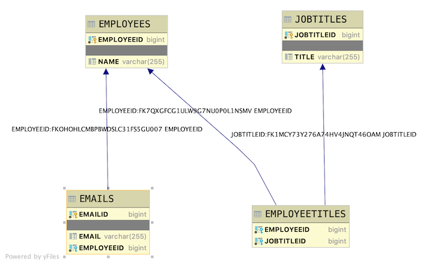

# Java Sample Employee Reading Data

## Introduction

This project is used to introduce Java Spring REST API CRUD applications. As such it is a small application showing just the code that is needed to explain the topic.

## Database layout

The table layouts are as follows:

- Employee is the driving table
- Email has a Many-To-One relationship with Employee. Each employee has many emails. Each email has only one employee.
- Jobtitles has a Many-To-Many relationship with Employee



Using the provided seed data, the given endpoint will produce the stated output. Expand each endpoint to see it's correct output.

<details>
<summary>http://localhost:2019/employees/employees</summary>

```JSON
[
    {
        "jobtitles": [
            {
                "jobtitleid": 1,
                "title": "Big Boss"
            },
            {
                "jobtitleid": 2,
                "title": "Wizard"
            }
        ],
        "employeeid": 1,
        "name": "CINNAMON",
        "emails": [
            {
                "emailid": 1,
                "email": "hops@local.com"
            },
            {
                "emailid": 2,
                "email": "bunny@hoppin.local"
            }
        ]
    },
    {
        "jobtitles": [
            {
                "jobtitleid": 2,
                "title": "Wizard"
            }
        ],
        "employeeid": 2,
        "name": "BARNBARN",
        "emails": [
            {
                "emailid": 3,
                "email": "barnbarn@local.com"
            }
        ]
    },
    {
        "jobtitles": [],
        "employeeid": 3,
        "name": "JOHN",
        "emails": []
    }
]
```

</details>

<details>
<summary>http://localhost:2019/employees/employeename/mon</summary>

```JSON
[
    {
        "jobtitles": [
            {
                "jobtitleid": 1,
                "title": "Big Boss"
            },
            {
                "jobtitleid": 2,
                "title": "Wizard"
            }
        ],
        "employeeid": 1,
        "name": "CINNAMON",
        "emails": [
            {
                "emailid": 1,
                "email": "hops@local.com"
            },
            {
                "emailid": 2,
                "email": "bunny@hoppin.local"
            }
        ]
    }
]
```

</details>

<details>
<summary>http://localhost:2019/employees/employeeemail/com</summary>

```JSON
[
    {
        "jobtitles": [
            {
                "jobtitleid": 1,
                "title": "Big Boss"
            },
            {
                "jobtitleid": 2,
                "title": "Wizard"
            }
        ],
        "employeeid": 1,
        "name": "CINNAMON",
        "emails": [
            {
                "emailid": 1,
                "email": "hops@local.com"
            },
            {
                "emailid": 2,
                "email": "bunny@hoppin.local"
            }
        ]
    },
    {
        "jobtitles": [
            {
                "jobtitleid": 2,
                "title": "Wizard"
            }
        ],
        "employeeid": 2,
        "name": "BARNBARN",
        "emails": [
            {
                "emailid": 3,
                "email": "barnbarn@local.com"
            }
        ]
    }
]
```

</details>
